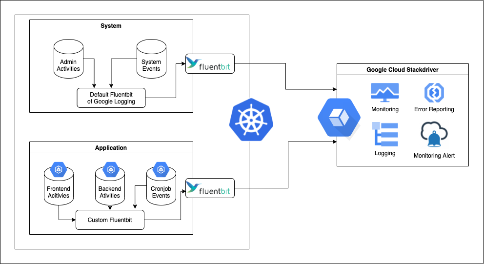
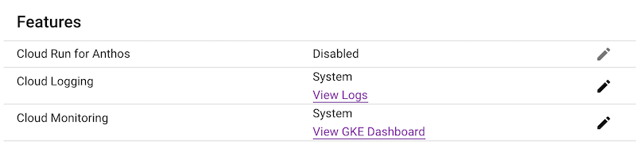
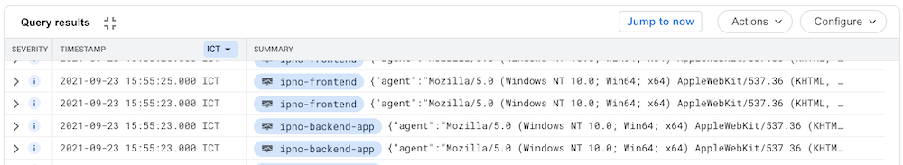
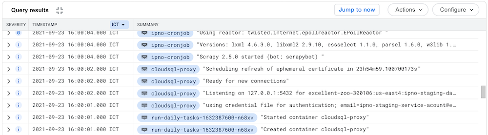

# Logging with Fluentbit & Google Cloud Logging

## 1. Intro
- [Fluent Bit](https://fluentbit.io/) is an open-source Log Processor and Forwarder which allows you to collect any data like metrics and logs from different sources, enrich them with filters and send them to multiple destinations. It's the preferred choice for containerized environments like Kubernetes.
- [Google Cloud Logging](https://cloud.google.com/logging) enables you to search, sort, and analyze logs through flexible query statements, along with rich histogram visualizations, simple field explorers, and the ability to save the queries.
- In our project, we use Fluentbit to collect logs from Kubernetes containers/pods and then filter, enrich the messages. After that, we send the log to Google Cloud Logging for querying & notification.

## 2. Flow
### a. Architecture flow


Overall, we use Fluentbit for 2 main purposes:
- Keep track of the system info. For this, we use default Fluentbit Logging of Google Kubernetes Engine (by turning on the Logging system of Kubernetes Cluster, the image below).

- Keep track of the application info. For this, we customize Fluentbit logging to send the information of Frontend, Backend, and Cronjob activities. The configuration will be described in the next section.
### b. Fluentbit flow


- The detailed concept of those blocks is at the link https://docs.fluentbit.io/manual/concepts/data-pipeline.
- For the application log, we collect our logs from the Kubernetes pods and enrich/format them by the Parser and the Filter (buffer as well). And after that, we will push those logs into Google Cloud Logging for querying.

## 3. Configuration
If you are new to Fluent Bit, it'd be better if you test the configuration locally before applying the config into our Kubernetes because the settings are applied for every pod in the cluster at the same time, so please be careful. 

Please take a look at the [Fluent Bit documentation](https://docs.fluentbit.io/) for referencing.
### a. Local running for testing
- The configuration for the Fluentbit is placed at the folder `fluent-bit`. Inside that folder, there are three files:
  - `Dockerfile.fluent`: Fluentbit docker build file.
  - `fluent-bit.conf`: the main config of the Fluentbit. We place the `Service`, `Input`, `Filter`, and `Output` configs inside this file.
  - `parser-fluent-bit.conf`: Fluentbit parser.
- To run the `Fluentbit` logging together with our `gunicorn` app, run command: `docker-compose -f docker-compose-logging.yml up`
- To test the service, open other terminal and run command such as `./bin/manage.sh --logging run_daily_tasks`. The option `--logging` needs to run our command with Fluentbit log tracking.
- After running the above command, you will see the log inside the former terminal. It looks like the below image.

- A little detail about the above flow:
  - First, `Scrapy` will log into `/var/log/python.log` file (inside the container) because of its custom configuration we set in the `base_scrapy_rss.py` file.
  - Then, Fluentbit reads the `/var/log/python.log` file by [Tail Input plugin](https://docs.fluentbit.io/manual/pipeline/inputs/tail) (see the `fluent-bit.conf` file) and set the tag as `python` (we share the log of Scrapy with python log in `settings/base.py`).
  - After that, the multiline `[Filter]` match the `python` log with `multiline-scrapy` parser (our custom parser). This parser is placed inside the `parser-fluent-bit.conf`. Read more about that at [Filters documentation](https://docs.fluentbit.io/manual/pipeline/filters).
  - For detailed info on the multiline parser, check [Fluentbit multiline parser documentation](https://docs.fluentbit.io/manual/administration/configuring-fluent-bit/multiline-parsing). In our system, we create our custom regex for matching the `start` and the `cont` part of Scarpy log.
  - Next, after concatenating the multi-line logs of Scarpy into one block. We parse each Scrapy log into a better form using other Parser. We first use our `[Filter]` with these attributes:
    - `Name` **parser** (to use the parser for this filter).
    - `Match` **python** (our tag of Scrapy logs).
    - `Key_Name` **log** (the field applying our regex parser).
    - `Parser` **scrapy** (our custom `scarpy` parser).
  - The `Parser` **scrapy** above is placed inside `parser-fluent-bit.conf`, it uses `regex` to extract the log and convert into the Fluentbit format (JSON). More detail at [Regex parser](https://docs.fluentbit.io/manual/pipeline/parsers/regular-expression).
  - Then, we modify the `log` key with the `message` key with the `[Modify]` filter.
  - And finally, we send the output to the `stdout` stream, so we can see it at our terminal console.
- We also create the log extracting flow for `gunicorn` and `python` too, you can investigate more inside the `fluent-bit.conf` and `parser-fluent-bit` files.

So those are all the steps for working with Fluentbit locally. Run it and learn it before you can jump into the `Google Cloud Logging`.

### b. Running on Google Cloud Kubernetes Cluster
Read this blog first to get the base idea of customizing Fluentbit log: https://cloud.google.com/community/tutorials/kubernetes-engine-customize-fluentbit

#### i. Setup
- First, we create the service accounts and the cluster role in a new logging namespace with this command:

`kubectl apply -f kubernetes/logging/fluentbit-rbac.yaml`

- Then, we deploy the Fluent Bit configuration:

`kubectl apply -f kubernetes/logging/fluentbit-configmap.yaml`

- Next, we deploy the Fluent Bit daemonset:

`kubectl apply -f kubernetes/logging/fluentbit-daemonset.yaml`

- And finally, check that the Fluent Bit pods have started:

`kubectl get pods --namespace=logging`

- If they're running, you see output like the following:
```
NAME               READY   STATUS    RESTARTS   AGE
fluent-bit-246wz   1/1     Running   0          26s
fluent-bit-6h6ww   1/1     Running   0          26s
fluent-bit-zpp8q   1/1     Running   0          26s
```

- Visit our [Staging page](https://staging.llead.co) and then go to our [Log explorer](https://console.cloud.google.com/logs/query;query=resource.labels.namespace_name%3D%22ipno-staging%22%0Aseverity%3E%3DDEBUG;timeRange=P1D;cursorTimestamp=2021-09-23T10:00:13Z?project=excellent-zoo-300106). You will see the logs such as the below image (my log view is reverted for easier viewing).
- 


- Click into any line, and you will see the detailed log of the record, such as `host`, `method`, ...

- When our Kubernetes cluster run the cronjob, you can see our Scrapy logs as the image below, we have concatenated the multiline logs and parse each Scrapy log in a better format for easier viewing:



- When you want to modify the logging behavior, you can change the file [Cloud Fluent Bit configs](../kubernetes/logging/fluentbit-configmap.yaml). The config syntax is similar to the Fluent Bit configs that we have set up locally. (You can also modify the [Cloud Fluent Bit deamonsets](../kubernetes/logging/fluentbit-daemonset.yaml) in case you want, but just do it if you really know about what you will apply because this config rarely needs to be changed). We will talk more about the configs later.

- After you have changed the configuration, you can apply those by running the shortage command we have created for you:

```
./bin/logging.sh
```


- After that, check our works have been successfully applied by running this command once again: 
```
kubectl get pods --namespace=logging
```
- If they have errors, check their logs for more information.

#### ii. Configuration
- The Fluent Bit configuration file is located at [Cloud Fluent Bit configs](../kubernetes/logging/fluentbit-configmap.yaml). This explanation is just a general explanation for the config and may be out of date later, you should read the [Fluent Bit documentation](https://docs.fluentbit.io/) to understand the config better. We will cover the `INPUT, OUTPUT, FILTER, PARSER` in this section.

- First, we collect the log from the Kubernetes containers by using `Tail` input plugin together with `Kubernetes Filter`. You can read it in detail at this link: [Kubernetes Filter](https://docs.fluentbit.io/manual/pipeline/filters/kubernetes). We merge the logs into a field called `log_processed`.

- Then, we lift the `log_processed` to extract the `log` and `time` fields using the [Nest Filter`](https://docs.fluentbit.io/manual/pipeline/filters/nest).

- After that, we filter and apply the [Multiline Filter](https://docs.fluentbit.io/manual/pipeline/filters/multiline-stacktrace), they are:
  - Built-in `python`.
  - Custom `multiline-python-extend` and `multiline-scrapy`

- Then we apply the normal parser using [Parser Filter](https://docs.fluentbit.io/manual/pipeline/filters/parser), they are:
  - `scarpy`: parser for scrapy message.
  - `cloudsql`: parser for cloud sql proxy.
  - `apache`: parser for gunicorn access message.
  - `nginx` : parser for frontend nginx message.

- The above parser using [Regex Parser](https://docs.fluentbit.io/manual/pipeline/parsers/regular-expression) Read the docs for more information.

- Next, we apply [Modify Filter](https://docs.fluentbit.io/manual/pipeline/filters/modify) to add loglevel into the message for easier query from Google Cloud Logging. We also replace the key `log` and `cloudsql_msg` with `message`.

- We place the mentioned above Parser at the end of the config file, you can use [Rubular](https://rubular.com/) to verify the working of those parsers.

- Finally, we use [Stackdriver Output](https://docs.fluentbit.io/manual/pipeline/outputs/stackdriver). It is the legacy name of our Google Cloud Logging. We use the **severity_key** `loglevel` to indicate the severity when those logs are displayed in Google Cloud Logging.
